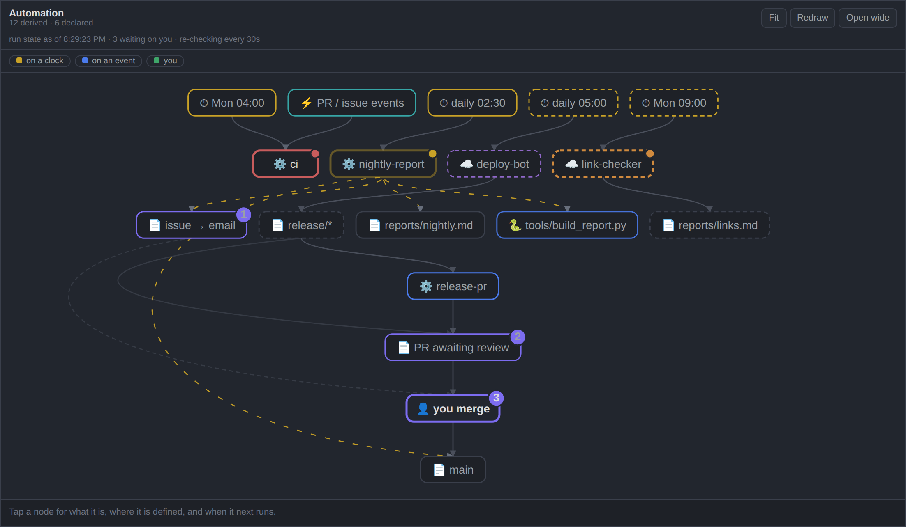

# Automation Graph

An Obsidian plugin that draws your repository's automation as a graph — **derived from the workflow files themselves**, not from a diagram you have to remember to update.



Most architecture diagrams are drawn once and slowly become fiction. This one is rebuilt from your files every time you open it, so it cannot drift. Add a workflow and it is in the picture; delete one and it is gone.

## What it reads

| Source | Where | What it contributes |
|---|---|---|
| `.github/workflows/*.yml` | repository | every workflow: its crons, its `push` / `issues` / `pull_request` triggers, and what its scripts actually do — `gh issue create`, `gh pr create`, `git push origin main`, files committed, scripts invoked |
| `.claude/` *(optional)* | repository | hooks and agents, if you use Claude Code |
| a note you nominate *(optional)* | vault | automation that runs **outside** this repository |

**Your vault does not have to be the repository**, and you should not have to tell it where one is.

On first open it looks for repositories with workflows in them — beside the vault, and in the usual places under your home folder — and offers what it finds as a list to click. Find exactly one and it just uses it, saying so in the header with a way to change it. The scan is breadth-first with a hard budget; it takes a few milliseconds and skips `node_modules` and the like.

If your layout is unusual, **Settings → Automation Graph → Repository path** takes a path directly: absolute, relative to the vault (`../work/api`), or starting with `~`. A path you set always wins over anything detected.

The declared-automation note is always read from the vault, wherever the repository lives.

Edges aren't listed anywhere — they're inferred from facts that match. If `release-pr.yml` waits on `push: branches: ["release/**"]` and something else produces `release/*`, that's an arrow. An edge means two files agree.

## Dashed nodes: declared, not verified

Automation that runs elsewhere — a cloud runner, a scheduler in another repo, a cron on your laptop — **cannot be proven from the repository you're looking at**. Rather than hardcoding it or pretending it isn't there, point the plugin at a note that declares it:

```markdown
| When | Piece | Live | What it does |
|---|---|---|---|
| daily 05:00 | `deploy-bot` | ☁️ | builds the site and pushes `release/*` branches |
| Mon 09:00 | `link-checker` | ☁️ | crawls the docs and writes `reports/links.md` |
```

Those become **dashed** nodes, labelled *declared, not verifiable from this repository*. The distinction between "I can show you this" and "I'm told this is true" stays visible instead of being flattened into one confident diagram.

Set the path in **Settings → Automation Graph → Declared automation note**. Leave it empty and the feature is simply off — which is the right picture for a repo whose automation all lives inside it.

## Drift

Once both halves are parsed, they can be checked against each other. A workflow that runs while no note beside your declared note describes it shows up as a **drift chip** in the header.

Only the provable direction is reported. A declared runner with no file is normal, not drift — that's the whole point of declaring it.

## Live run state

Optionally, the graph colours itself from GitHub: red where a workflow's last run failed, yellow where one is running, orange where a declared runner has gone quiet past two of its own cycles, and a count of open PRs and issues on the human gate.

This half crosses a network, so it follows one rule:

> **Absence is never success.** A node that could not be fetched stays unmarked and the header says why. Nothing renders as passing because a request failed.

Only trouble is marked. A panel that decorates every healthy node teaches you to stop reading its decorations.

**Staleness needs no network** — it reads `git log` on the files a runner produces, and measures against the runner's own cadence (the gap between its next two cron firings), not a threshold invented by the plugin. That signal works offline.

### Tokens

Needed only for run state, and only for private repositories. Looked up in this order:

1. the plugin setting
2. `$VAULT_PAT` / `$GITHUB_TOKEN` / `$GH_TOKEN`
3. `gh auth token` — tried at several known install paths
4. `~/.config/gh/hosts.yml`

If `gh` is authenticated on your machine, this usually works with **nothing stored on disk**.

> A GUI-launched app on macOS inherits a bare `PATH` and none of your shell profile, so `gh` at `/opt/homebrew/bin/gh` is invisible to it and exported variables are missing. That's why the search covers explicit paths, and why **Settings → Test connection** prints everything it tried rather than a bare "no token".

A token typed into settings is stored in the plugin's `data.json`, which `.gitignore` excludes. Prefer `gh` or the environment.

## Keeping current

- **Structure** follows the files. Editing a workflow, or pulling one, redraws within about half a second. Obsidian's atomic saves are handled, so editing the declared note *in Obsidian* works.
- **Run state** is fetched when the panel opens, when you ask, and **every 30 seconds while a run is actually in flight** — then it goes quiet again. The idle interval is a setting, default off.
- The header always states its cadence, so a live panel and a frozen one never look alike.

It is not real-time and can't be: GitHub does not push to a desktop app.

## Using it

| Gesture | Does |
|---|---|
| click a node | what it is, its defining file, its triggers, its next fire time |
| hover | lights that node and its neighbours |
| wheel | zoom (shift+wheel pans) |
| drag background | pan |
| drag a node | move it — the position persists |
| double-click empty space | fit everything back in view |

Selecting a node plays the chain it sets off as a wave, hop by hop — the quickest way to answer "what happens when this fires?".

Nodes are laid out by rank: clocks at the top, the human gate in the middle, `main` at the bottom. Dragging a node stores an *offset* from that layout, so untouched nodes keep following it as your automation changes. **Reset node positions** in the command palette undoes the lot.

There is deliberately **no force layout**. This is a directed graph and position carries meaning; a physics simulation would make it prettier and less true.

## Install

**From Obsidian** — Settings → Community plugins → Browse → "Automation Graph".

Or:

**Manually** — download `main.js`, `manifest.json` and `styles.css` from the latest release into `<vault>/.obsidian/plugins/automation-graph/`, then enable it in Settings → Community plugins.

**With [BRAT](https://github.com/TfTHacker/obsidian42-brat)** — add this repository as a beta plugin.

Desktop only. `.github/` and `.claude/` are dot-folders, which Obsidian's index excludes, so the files are read through node's `fs` — which the mobile app doesn't have.

## Settings

| Setting | Default | |
|---|---|---|
| Repository path | *(empty — detected, else the vault)* | folder holding `.github/workflows`; absolute, `../relative`, or `~/…` |
| Find repositories | — | lists repositories with workflows to pick from |
| Test connection | — | finds a token, says where it came from, makes one real request |
| Open in | Main pane | main pane or left sidebar |
| Animation | Only what is happening | or everything flowing, or off |
| Declared automation note | *(empty)* | path to the note declaring off-repo automation |
| Timezone | system | override for cron display |
| Idle re-check | 0 (off) | minutes between fetches while nothing is running |
| GitHub token | *(empty)* | only if `gh` and the environment can't supply one |
| Path to `gh` | *(empty)* | if `gh` lives somewhere unusual |

`prefers-reduced-motion` overrides the animation setting in every case.

## Checking it yourself

```bash
node check.js /path/to/your/repo

# repository and vault in different places — the usual arrangement
node check.js /path/to/repo --vault /path/to/vault --declared notes/automation.md

# just the code checks, no repository needed — what CI runs
node check.js --unit
```

Runs the same parse → build → layout → SVG path outside Obsidian and prints what it derived: every node, its source file, every edge, and any drift. It also unit-checks the repository-path resolution. Exits non-zero if it derives no runners, so a parser regression is catchable from a terminal or from CI.

## Releasing

Push a tag matching the version — `1.2.3`, no `v` — and [`.github/workflows/release.yml`](.github/workflows/release.yml) does the rest: it refuses to publish unless the tag, `manifest.json` and `versions.json` all agree, runs the code checks, attaches `main.js` / `manifest.json` / `styles.css`, and attests their provenance so anyone can verify they were built from this repository.

The agreement check exists because getting it wrong is silent. Obsidian reads the tag as the version and never looks at the branch; a mismatched or `v`-prefixed tag produces a release that simply is never offered to anyone.

## What it accesses, and why

Obsidian's automated review flags two things about this plugin. Both are accurate, and both are the plugin working as intended:

| Flag | Why |
|---|---|
| **Direct filesystem access** | `.github/` and `.claude/` are dot-folders, which Obsidian's index excludes — `fs` is the only way to read them. Also why it is desktop-only. |
| **Shell execution** | `gh auth token`, so run state works without storing a token on disk, and `git log`, so staleness works offline. Both run through `execFileSync` with argument arrays, never a shell string. |

Neither can be removed without removing what the plugin is for. Nothing is written outside the plugin's own `data.json`, and no network request is made except to `api.github.com`, only when you have asked for run state.

## Limitations

- **GitHub Actions only.** Other CI systems aren't parsed.
- **Not a general diagramming tool.** It draws what it can derive; it won't draw what you tell it to.
- **Heuristic edges.** Emissions are recognised from common commands (`gh issue create`, `git push`, committed paths). Something exotic will simply produce fewer edges — it won't produce wrong ones.

## Licence

MIT.
